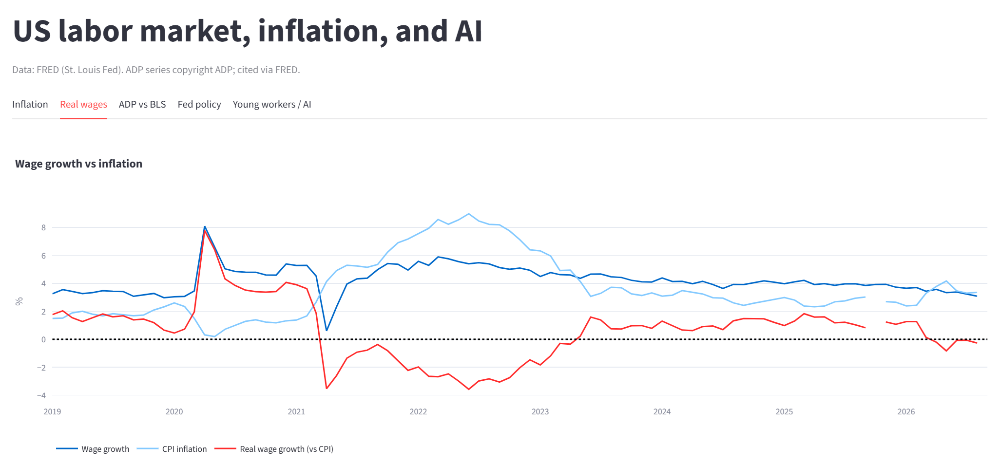

# ]([https://github.com/Clairechen163/labor-inflation-ai/actions/workflows/ci.yml/badge.svg?branch=main)]([https://github.com/Clairechen163/labor-inflation-ai/actions/workflows/ci.yml](https://github.com/Clairechen163/labor-inflation-ai/actions/workflows/ci.yml)](https://github.com/Clairechen163/labor-inflation-ai/actions/workflows/ci.yml/badge.svg?branch=main)]([https://github.com/Clairechen163/labor-inflation-ai/actions/workflows/ci.yml](https://github.com/Clairechen163/labor-inflation-ai/actions/workflows/ci.yml))))


# US Labor, Inflation & AI

An interactive dashboard asking: **is wage growth driving US inflation, and is there early evidence that AI is affecting hiring?**

Data comes from the [FRED API](https://fred.stlouisfed.org/docs/api/) (St. Louis Fed), refreshed daily in the app.

> 


## Key findings (as of September 2026)

Update these from the dashboard before publishing.

1. **Inflation is energy-led, not wage-led.** August CPI was 3.4% YoY with energy up 16.3%, while ADP base pay rose 3.2%. Wages are slightly trailing prices.
2. **CPI and PCE gap narrowed.** August headline PCE (3.4%) matched headline CPI (3.4%). Core PCE (3.0%) still ran above core CPI (2.4%). Different weights may explain part of this; see Methods.
3. **The Fed is tightening because of inflation, not weak labor demand.** It raised rates to 3.75-4.00% on Sept 16. The unemployment rate was 4.1% in August, and ADP private payrolls rebounded to +90,000 in September after a revised +36,000 in August. Hiring is slower than before 2025, but the Fed describes the labor market as stable.
4. **AI evidence is inconclusive.** Aggregate unemployment shows no clear AI effect. Unemployment for ages 20-24 rose relative to the overall rate during 2024-2025 but has since narrowed to roughly its 2019 level, so this chart alone doesn't show lasting AI displacement.


## What changed this month (September 30 release)

- **August PCE:** headline +0.3% m/m and 3.4% YoY (July: 3.7%); core +0.2% m/m and 3.0% YoY (July: 3.3%). Core came in below the ~3.4% forecast.
- **- ADP (Sept 30):** private payrolls +90,000 in September (August revised to +36,000). Base pay +3.2% YoY.
- **Real disposable income was flat (0.0%)** even as spending rose 0.9%, so consumers are spending faster than income is growing.
- The release included BEA's annual update, which can revise earlier months.
- Source: BEA, Personal Income and Outlays, August 2026.


## Run it

```bash
git clone https://github.com/Clairechen163/labor-inflation-ai.git && cd labor-inflation-ai
python -m venv .venv && source .venv/bin/activate
pip install -r requirements.txt
cp .env.example .env        # add your free FRED API key
export FRED_API_KEY=...     # or set in .streamlit/secrets.toml
streamlit run app.py
pytest                      # unit tests for derived measures
```


## Structure

```
app.py            Streamlit dashboard
src/fetch.py      FRED API pulls -> monthly table
src/analysis.py   YoY inflation, job changes, real wages, youth gap
src/charts.py     Plotly figures
tests/            pytest checks on the calculations
.github/          CI + monthly live-fetch smoke test
```


## Methods

- Inflation = 12-month % change in the CPI/PCE indexes.
- Real wage growth = wage growth YoY minus inflation YoY (percentage-point difference).
- ADP monthly change = first difference of the ADP level series; BLS from PAYEMS.
- Youth gap = unemployment rate ages 20-24 minus overall rate.


## Limitations

- ADP and BLS monthly job changes often differ in size and occasionally in sign (for example, early 2024 and February 2026), so ADP is best read as a rough preview of the official data.
- The youth-unemployment gap has many causes and does not isolate AI. Treat it as a signal to watch.
- Wage series here is average hourly earnings, which differs from ADP's base pay measure.
- Series IDs are listed in `src/fetch.py`. If FRED renames or retires a series, that chart will be empty until the ID is updated.
- October 2025 is missing from the CPI and household-survey series (including the unemployment rates) because the federal government shutdown prevented BLS from collecting the data, and it cannot be collected retroactively. Charts show a gap there, and year-over-year figures that use October 2025 as a base (such as October 2026) will also be missing. Wage data come from a different survey and are not affected.
- The 20-24 unemployment rate counts only people actively looking for work, and includes recent graduates and students entering the labor force. It does not measure hiring in AI-exposed occupations, which is where studies looking for AI effects focus (for example, Stanford's analysis of payroll data by occupation).
- Average hourly earnings jumped in spring 2020 because job losses were concentrated among low-wage workers, not because individual wages rose. Real wage growth here is a simple percentage-point difference (wage growth minus inflation), an approximation.


## Data and licensing

Data via FRED; ADP data is copyrighted by ADP and cited here through FRED. Raw data files are not committed to this repository.